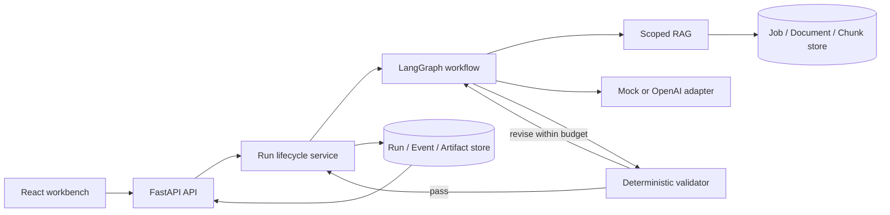

# Agent Platform

> Evidence-grounded job application agent：把职位要求与候选人提供的证据组织成可追溯、可校验、可恢复的材料包。

Agent Platform 是一个本地单机演示项目，用固定的六节点 LangGraph workflow 管理求职材料的生成与校验。用户粘贴职位描述和自己的履历、项目或作品证据；系统用规则拆分要求、检索所选资料中的相关片段、生成结构化材料包，并在发布前检查引用、原文对应和要求覆盖。没有检索到证据的要求必须记录为 evidence gap。

当前输出是带引用的简历要点和缺口清单：claim 与简历要点必须逐字对应证据摘录，非空求职信不能通过发布校验。这些检查证明输出与所提供资料一致，不证明原始资料真实，也不判断经历是否在语义上满足职位。默认使用无模型调用的 Mock；OpenAI adapter 的真实连接与输出效果尚未验证。项目尚无登录、成员权限或生产任务队列，不是生产级多租户平台。

第一次使用可先读 [Agent 配置、操作与产出核验指南](docs/AGENT_WALKTHROUGH.md)，或打开当前 workspace 的 `/workspaces/{workspace_id}/overview`，查看部署配置、工作流和实际计数。

## 为什么不是普通聊天封装

- **Grounded generation**：成功发布的每条候选人 claim 都必须追溯到当前 workspace 中的 Document/Chunk。
- **Explicit gaps**：成功发布时，没有检索证据的职位要求必须输出 gap；gap 表示资料不足，不等于候选人一定缺少这项能力。
- **Deterministic publication gate**：只有通过独立 validator 的 Artifact 才能以成功状态发布。
- **Observable execution**：Run 状态、节点事件、尝试次数、校验结果和最终产物均可查询。
- **Bounded recovery**：Provider retry 和图修订都有上限；checkpoint、租约与 execution token 支持安全恢复。
- **Offline regression**：默认自动测试和固定评测不访问真实模型，结果可重复。

## 核心能力

1. 创建 workspace-scoped Job 和纯文本证据 Document。
2. 对 Document 进行幂等摄取、分块和来源持久化。
3. 以词频向量和余弦相似度执行限定 workspace/document 的 Top-K 检索，不调用语义 embedding 模型。
4. 输出 Requirement、Evidence、Claim、Citation、Gap 和 ApplicationArtifact 严格结构。
5. 使用 LangGraph 编排 extract、retrieve、draft、validate、bounded revise 和 terminal。
6. 通过 Run、RunEvent、ArtifactRecord、checkpoint、幂等键和条件 Resume 管理执行生命周期。
7. 隔离 Deterministic Mock 与 OpenAI Responses Provider adapter，统一脱敏错误和重试语义。
8. 在 React 工作台中完成创建、岗位列表搜索/分页、Agent 概览、轮询、刷新恢复、事件查看、引用核验和失败恢复。
9. 运行版本化离线评测，输出 retrieval、citation、coverage、gap 和 guardrail 指标。

## 工作流

这是一个固定图编排的 Agent 工作流，不是六个自主 Agent 或 multi-agent 系统；模型不会自主选择工具。仅 `draft` 和 `revise` 调用所配置的 Provider。

| 节点 | 实际处理 | 输出 |
| --- | --- | --- |
| `extract` | 按换行或英文句末分段，每段最多 800 字符、最多 20 条；首条 high，其余 medium | 规则提取的要求列表 |
| `retrieve` | 对每条要求，在选定资料中按词频余弦检索 Top-5，核对数据库来源 | 带 Document/Chunk 引用的证据摘录 |
| `draft` | Mock 选取证据，或调用 OpenAI 输出严格结构 | 一个材料包草稿 |
| `validate` | 检查原文对应、引用、覆盖、缺口和标识一致性 | 通过结果或问题列表 |
| `revise` | 使用同一批要求和证据修订，再回到 validate | 新草稿；默认最多 2 轮 |
| `terminal` | 发布通过校验的材料包；未通过则结束为 validation_failed | 明确终态 |

```text
React workbench
  → create Job
  → create + ingest Document
  → POST Run with Idempotency-Key
  → 202 Accepted + recoverable Run URL
  → poll trusted Run read model

Run lifecycle
  → claim lease
  → extract → retrieve → draft → validate → terminal
                                  │   ↑
                    fail + budget │   │ validate again
                                  ↓   │
                                 revise
  → succeeded + published Artifact
    or validation_failed without published Artifact
    or failed + conditional resume
```

Run 状态机：

```text
queued → running → succeeded
                 → validation_failed
                 → failed

failed + retryable ──resume──→ running
running + expired lease ──reclaim/resume──→ running
```

是否能够恢复始终以后端的 `can_resume=true` 为准。前端对引用来源、终态校验和恢复资格的安全判断，只信任后端返回的 `citation_sources`、`terminal_validation` 和 `can_resume`；它不会自行跨 workspace 查询来源、从开放 Event 数据推导安全结论，或把网络故障伪装成业务失败。

## 系统架构



| 层 | 职责 | 主要入口 |
| --- | --- | --- |
| React UI | 创建链、可恢复 URL、轮询、状态和证据展示 | `frontend/src/pages`、`hooks`、`components` |
| HTTP API | Job、Document、ingestion、retrieval 和 Run 接口 | `backend/app/main.py`、`backend/app/api` |
| Run lifecycle | 幂等启动、状态事务、事件、租约和恢复 | `backend/app/run_service.py`、Run ORM models |
| Executor | 从可信数据库输入组合 Provider、RAG、Graph 和 validator | `backend/app/application_executor.py` |
| Agent graph | extract/retrieve/draft/validate/revise/terminal | `backend/app/agent/graph.py` |
| RAG | 分块、摄取、词频向量余弦排序和 scoped retrieval | `backend/app/rag` |
| Provider | 可重复 Mock 与 OpenAI Responses adapter | `backend/app/providers.py`、`openai_provider.py` |
| Safety gate | 对可信 requirements/evidence 执行引用和 coverage 校验 | `backend/app/validation.py` |
| Evaluation | 隔离数据集执行、质量指标、报告和退出码 | `backend/app/evaluation.py`、`eval_cli.py` |

## 已实现的工程控制

| 风险 | 当前控制 |
| --- | --- |
| 输出加入资料中不存在的经历 | Evidence/Citation 与逐字原文校验；无证据必须输出 Gap；不核验源资料真实性 |
| 单次请求混用不同 workspace 的资源 | API、Service、数据库关系和发布前 verifier 多层限定；workspace scope 不等于用户认证或授权 |
| 重复启动和重复执行 | workspace 内唯一 Idempotency-Key 与规范化请求冲突检测 |
| 旧 worker 覆盖新结果 | 到期租约、heartbeat 和 execution-token fencing |
| 临时 Provider 故障 | timeout/connection/409/429/5xx 有界重试；永久错误 fail-fast |
| 非法 Structured Output | Pydantic parse 后仍运行 deterministic validator |
| 敏感错误泄漏 | SecretStr、字段级配置校验、固定错误码和脱敏 Provider 异常 |
| 本地回归未被发现 | pytest、前端 smoke、固定 evaluator 和非零退出码；CI 尚未实现 |

## 快速开始

### 前置条件

- Python 3.12 或更高版本
- [uv](https://docs.astral.sh/uv/)
- Node.js 与 npm

默认 Mock 路径不需要 OpenAI API key，也不会发起模型网络请求。

### Agent 配置

本地后端读取 `backend/.env` 或进程环境变量；以下是部署级设置，前端概览只读展示，不会在线修改配置。配置变更后重启后端。历史 Run 保留其 provider/model 标识，概览的配置卡表示当前部署设置。

| 环境变量 | 默认值 | 含义 |
| --- | --- | --- |
| `AGENT_PLATFORM_LLM_PROVIDER` | `mock` | `mock` 或 `openai` |
| `AGENT_PLATFORM_OPENAI_API_KEY` | 无 | 仅 OpenAI 模式必填；只保留在服务端 |
| `AGENT_PLATFORM_OPENAI_MODEL` | 无 | OpenAI 模式必填的模型 ID |
| `AGENT_PLATFORM_AGENT_MAX_REVISIONS` | `2` | 校验不通过后的修订上限，范围 0–5 |
| `AGENT_PLATFORM_PROVIDER_RETRY_MAX_ATTEMPTS` | `3` | 每次 Provider 调用的总尝试次数，范围 1–5，包含首次调用 |
| `AGENT_PLATFORM_PROVIDER_RETRY_INITIAL_DELAY_SECONDS` | `0.5` | 临时 Provider 错误的初始退避延时，单位秒，范围 0–60 |

修订解决材料校验问题；重试处理连接、限流等临时调用失败，两者不能混算。切换真实模型前应先阅读[配置与现有输出限制](docs/AGENT_WALKTHROUGH.md#agent-怎样配置)。

### 1. 启动后端

```bash
cd backend
uv sync
uv run uvicorn app.main:app --reload --host 127.0.0.1 --port 8000
```

健康检查：

```text
GET http://127.0.0.1:8000/api/v1/health/live
→ 200 {"status":"ok"}
```

### 2. 启动前端

在第二个终端运行：

```bash
cd frontend
npm ci
npm run dev
```

打开 [http://127.0.0.1:5173](http://127.0.0.1:5173)。Vite 会把开发期 `/api` 请求代理到本地 8000 端口。创建页目前接收粘贴的纯文本证据，不支持 PDF/Word 文件上传。

### 3. Docker Compose（替代以上两个本地进程）

本地容器切片固定使用 Mock Provider，以非 root FastAPI 和 Nginx 两个容器运行，并把 SQLite 数据保存在 Docker named volume：

```bash
docker compose up --build --wait
```

打开 [http://127.0.0.1:8080](http://127.0.0.1:8080)。完整的无缓存构建、健康检查、非 root 和基础 HTTP 验收可运行：

```bash
./scripts/docker-smoke.sh
```

Compose 显式配置 `AGENT_PLATFORM_LLM_PROVIDER=mock`；修改 `backend/.env` 不会把 Docker 服务切换到 OpenAI。概览页显示实际服务的当前配置，避免将本地后端和容器后端混淆。

普通 `docker compose down` 会保留数据；`docker compose down -v` 会永久删除本地演示数据库。拓扑、持久化复验和当前边界见 [Docker 一日版本](docs/DOCKER.md)。

服务启动后的日志、端口、Linux 文件权限及连接排查，可按 [Linux / Docker 实操](docs/LINUX_DOCKER_LAB.md) 练习；`bash scripts/docker-ops-lab.sh` 使用独立练习资源自动验证 8 项操作，并保留现有应用数据。

## 主要 HTTP 接口

所有业务接口都以 workspace 为数据作用域；启动后可在 [http://127.0.0.1:8000/docs](http://127.0.0.1:8000/docs) 查看交互式 OpenAPI 文档。

| 方法 | 路径 | 用途 |
| --- | --- | --- |
| `GET` | `/api/v1/workspaces/{workspace_id}/overview` | 当前部署的公开配置白名单和当前 workspace 的产出统计 |
| `POST` | `/api/v1/workspaces/{workspace_id}/jobs` | 创建职位 |
| `GET` | `/api/v1/workspaces/{workspace_id}/jobs/{job_id}` | 读取职位 |
| `POST` | `/api/v1/workspaces/{workspace_id}/documents` | 保存纯文本证据 |
| `POST` | `/api/v1/workspaces/{workspace_id}/documents/{document_id}/ingest` | 幂等摄取并返回 Chunk |
| `POST` | `/api/v1/workspaces/{workspace_id}/retrieval` | 在指定 Document 范围内检索 |
| `POST` | `/api/v1/workspaces/{workspace_id}/jobs/{job_id}/runs` | 使用 `Idempotency-Key` 启动 Run |
| `GET` | `/api/v1/workspaces/{workspace_id}/runs/{run_id}` | 查询状态、事件、校验和 Artifact |
| `POST` | `/api/v1/workspaces/{workspace_id}/runs/{run_id}/resume` | 条件恢复 retryable failure 或租约已过期的 Run |

启动和恢复接口返回 `202 Accepted`，表示 Run 已被接受并进入后台执行，不表示材料已经生成成功；客户端应继续查询 Run，直到进入明确终态。

概览接口仅返回明确允许公开的 provider、model、修订/重试设置、检索方式与计数，不返回 API key、数据库地址、环境变量全集、JD 或证据正文。workspace 过滤仍不构成登录或成员权限。

## 多少 JD，产生多少材料

一次 Run 对应一个已保存的 JD，成功后发布一个 ApplicationArtifact 材料包；同一个 JD 多次新建 Run 可以产生多个包。同一幂等请求或同一 Run 的恢复不会增加包数。要点、缺口和引用是包内条目，不应各算一份材料；全部是 gap 的包也可能成功发布。

概览将已保存 JD、参与运行的 JD、Run、成功包、含简历要点的包、仅缺口包、要点与 gap 条目分别计数，同时区分 Mock 与 OpenAI 运行。成功不代表已经得到可投递的完整简历。

2026-09-09 先核验了 3 条原始演示记录，随后使用可重复执行的合成数据脚本把三个指定 workspace 各补到 100 条 JD。现在共有 300 条 JD 记录，其中 297 条标题和正文均明确标记为 synthetic；原有 Run 和材料包没有复制或补造：

| 数据来源 / workspace | 已保存 JD 记录 | 成功 Mock Run | 发布包 | 简历要点 | gap | 求职信 |
| --- | ---: | ---: | ---: | ---: | ---: | ---: |
| Docker / `docker-acceptance` | 100 | 1 | 1 | 1 | 0 | 0 |
| 本地 SQLite / `test-grounded` | 100 | 1 | 1 | 1 | 0 | 0 |
| 本地 SQLite / `test-gap` | 100 | 1 | 1 | 0 | 1 | 0 |

准确口径是：**3 个演示 workspace 共保存 300 条 JD，只有 3 条参与过运行；共 3 次成功 Mock Run、3 个发布包、2 个含简历要点的包和 1 个仅 Evidence Gap 的包。** 新增的 297 条仅用于列表、分页、搜索和 workspace 统计演示，不是 297 次 Agent 执行。

这些是不同数据库或 workspace 的合成演示记录，不能称为“处理了 300 个真实职位”、300 次评测、300 份材料或真实模型效果；冻结的 3-case `smoke-v1` 是另外的合成回归测试，也不能计入用户使用量。目前没有可报告的真实求职样本质量提升率。填充脚本、数据口径和自有样本核验方法见[Agent 指南](docs/AGENT_WALKTHROUGH.md#300-条演示-jd-怎样生成)。

## 质量与验证

后端：

```bash
cd backend
uv run python -m pytest tests -q
uvx --from ruff==0.16.5 ruff check app tests
uv lock --check
```

前端：

```bash
cd frontend
npm test
npm run typecheck
npm run lint
npm run build
```

固定评测：

```bash
cd backend
uv run python -m app.eval_cli
uv run python -m app.eval_cli --format json
```

`smoke-v1` 当前冻结三个 synthetic case：可信证据成功、无证据生成 gap、伪造 citation 被阻断。五项质量指标的门禁要求是 retrieval recall@5 不低于 `0.8`，citation validity、citation coverage、requirement coverage 和 gap accuracy 在适用时均为 `1.0`。除此之外，可发布 Artifact 不得包含 unsupported claim，伪造引用 guardrail case 必须被阻断。详细合同见 [Evaluation](docs/EVALUATION.md)。

前端的 3-case MSW smoke 验证 HTTP 场景和界面状态，不等于真实浏览器 Playwright E2E 或公网环境验收。

## Stage 1–9 交付状态

| 阶段 | 交付能力 | 状态 |
| --- | --- | --- |
| Stage 1 · FastAPI 基线 | 应用入口、liveness 和最小 HTTP 测试 | 完成并提交 |
| Stage 2 · 数据库与领域 API | 异步 SQLAlchemy、Job/Document、约束、workspace-scoped API 和 lifespan | 完成并提交 |
| Stage 3 · 文档摄取与 RAG | Chunk、幂等 ingestion、来源追踪和 scoped deterministic retrieval | 完成并提交 |
| Stage 4 · 结构化输出与校验 | Artifact contracts、Mock Provider 和可信引用 validator | 完成并提交 |
| Stage 5 · 有界 LangGraph | 六节点工作流、条件修订、明确终态和错误分层 | 完成并提交 |
| Stage 6 · OpenAI Provider | Responses adapter、strict parse、配置和脱敏错误 | 离线适配完成；live 延期 |
| Stage 7 · Run 与恢复 | Run/Event/Artifact、202 后台执行、幂等、重试、checkpoint、lease/fencing 和 Resume | 本地工程实现完成 |
| Stage 8 · 固定评测 | 指标、CLI 和版本化 `smoke-v1` | 3-case 初期切片完成；正式 10-case 待办 |
| Stage 9 · React 操作台 | 创建链、Run URL、轮询、事件、引用、gap 和条件 Resume | 本地 Mock 闭环完成；非公开部署 |

详细路线和后续阶段见 [Development Roadmap](docs/DEVELOPMENT_ROADMAP.md)。

## 仓库结构

```text
agent-platform/
├── backend/
│   ├── app/
│   │   ├── agent/            # LangGraph state and workflow
│   │   ├── api/              # FastAPI routers
│   │   ├── models/           # SQLAlchemy persistence
│   │   ├── rag/              # chunking, ingestion and retrieval
│   │   ├── schemas/          # Pydantic contracts
│   │   ├── application_executor.py
│   │   ├── evaluation.py
│   │   ├── openai_provider.py
│   │   ├── run_service.py
│   │   └── validation.py
│   ├── tests/
│   ├── pyproject.toml
│   └── uv.lock
├── frontend/
│   ├── src/
│   │   ├── api/
│   │   ├── components/
│   │   ├── hooks/
│   │   ├── pages/
│   │   └── state/
│   ├── package.json
│   └── vite.config.ts
├── evals/datasets/smoke-v1/cases.json
├── docs/
└── PARTICIPATION.md
```

## 已知边界与下一步

- `workspace_id` 是数据作用域，不是 authentication 或 membership authorization。
- 当前检索是词频余弦路径，不是语义 embedding；连续中文分词和同义表达召回能力有限。
- OpenAI adapter 只通过 fake-client 离线合同测试；真实连接、费用、输出质量及 validator 兼容性未验证。
- Structured Outputs 保证结构和类型，不保证内容真实。
- 当前发布校验只允许逐字对应证据的 claim/简历要点，非空求职信不能发布；并未实现完整简历排版或语义事实核验。
- FastAPI `BackgroundTasks` 是单进程本地调度，不是 durable worker。
- SQLite `create_all` 不是 migration 系统；PostgreSQL/Alembic 尚未实现。
- Run 幂等无法保证供应商端 exactly-once；Job/Document 创建结果未知时，重试仍可能产生重复记录。
- 正式 Stage 8 需要新建不可变的 10-case 数据集，不能原地扩写 `smoke-v1`。
- Stage 9 没有账号、认证、Run 历史列表、文件上传、WebSocket、自动职位搜索或自动投递；新增的岗位列表严格限制在单一 workspace。
- Docker Compose 本地演示、非 root 容器和 named-volume 持久化已完成；readiness、生产 Secret/CORS、PostgreSQL migration、CI、durable worker/生产任务队列仍属于后续部署 backlog。

系统不会替招聘方做录用判断，也不保证生成材料获得面试；所有输出必须由用户在使用前审核。

## 项目文档

- [Agent 配置、操作与产出核验指南](docs/AGENT_WALKTHROUGH.md)
- [产品合同与证据规则](docs/PRODUCT_SCOPE.md)
- [开发路线与阶段状态](docs/DEVELOPMENT_ROADMAP.md)
- [Stage 8 固定评测](docs/EVALUATION.md)
- [Stage 9 React 操作台](docs/FRONTEND.md)
- [Docker 一日版本](docs/DOCKER.md)
- [学习参与与工程记录](PARTICIPATION.md)
